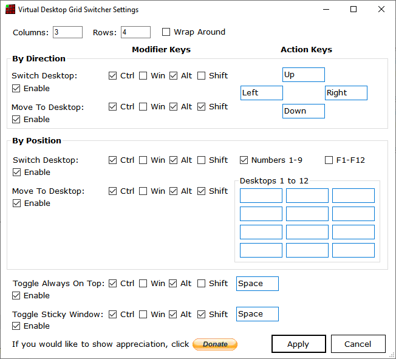

Virtual Desktop Grid Switcher User Guide
========================================

Virtual Desktop Grid Switcher allows you to switch and move the current active window between Windows 10 Virtual Desktops in a virtual grid layout using arrow keys. This is helpful if like me you use more than a few desktops. The default layout is a 3x3 grid of desktops.

You can also make a window always visible on top of other windows or sticky (visible on all desktops) using a keyboard shortcut when that window is active.

Once the application is running you will see a new icon in your system tray.

If you right click this you can exit or modify the settings.

Grid Layout
-----------

You can change the Columns and Rows in your grid. If you do this you will probably want to change the icons used for each desktop. These can be found in the Icons folder of your installation. Alternative icon sets are available from VirtuaWin which inspired the development of this program at https://virtuawin.sourceforge.io/?page_id=48

When you increase the number of desktops required they are automatically created for you. Reducing the number required leaves them for you to delete using the usual method (but you will not be able to access them via the arrow keys).

DO NOT PUT TOO LARGE NUMBERS IN THE ROWS AND COLUMNS AS WINDOWS WILL GRIND TO A HALT with so many desktops and you will have a hard time deleting them all. Even restarting won’t help!

You can enable Wrap Around mode which means that if you go right from the rightmost desktop it wraps around to the leftmost in the same row and vice versa and same for up and down in columns.

Key Assignment
--------------

You can change the key combinations for switching desktops, moving the currently active window to another desktop and switching to that desktop, and the Always on Top and Sticky Window features.

Note if another program is already using a key combination you will be warned that it could not be assigned. You will either need to change the key combinations or find out what is using it already and stop it from doing so. Often your graphics software has some of these keys assigned.

Each operation Switch/Move/Always On Top/Sticky Window can be enabled/disabled separately.

You can configure the direction keys for Switch/Move to use different keys than the arrow keys.

You can enable number and/or F1-12 keys to switch/move to a particular desktop by number and also a set of custom keys for desktops 1-12 (it is actually possible to configure more if you directly edit the file VirtualDesktopGridSwitcher.Settings - click Apply in settings if you don't have that file). Note that the F1-12 keys are very commonly already assigned for other uses.

All of the above use the same modifier key combinations for Switch/Move.

Window Activation on Switch From Empty Desktop
----------------------------------------------

Virtual Desktop Grid Switcher fixes an issue in Windows 10 where switching from a desktop which is empty to a desktop which had an activate window does not reactivate that window.

Opening Word / Excel / Acrobat Reader Documents
-----------------------------------------------

Word and Excel documents opened from windows explorer or menus can end up opening on another desktop if there is another document open on another window. Oddly, my current version of Office 365 version 2107 seems to fix this for Word but not Excel!

This also happens for PDFs opened in Acrobat Reader with tabbed mode disabled. 

Virtual Desktop Grid Switcher attempts to detect the switching of the desktop to that of the other document and then the new document in quick succession and moves the new document window to the original desktop. 

If this is not working for you, you may need to increase the MoveOnNewWindowDetectTimeoutMs value in the VirtualDesktopGridSwitcher.Settings file - click Apply in settings if you don't have one. This is in milliseconds and determines what "quick succession" means. In version 2.5.0.0 this was increased to 3 seconds since this seems to be necessary unless the file is simple to load in Excel.

You can also add the executable name for other programs you think might benefit from this to MoveOnNewWindowExeNames (or remove word and excel if it is causing problems for you or prefer the original behaviour).

Support
-------

If you have questions please ask them on the SourceForge Discussion Page <https://sourceforge.net/p/virtual-desktop-grid-switcher/discussion/>

If you think something is not working correctly raise a ticket on the SourceForge Tickets Page <https://sourceforge.net/p/virtual-desktop-grid-switcher/tickets/>

Default Browser Activation (Disabled by default since v2.5.0.0)
------------------------------------------------

In the past, Chrome and Firefox and Internet Explorer did not open links clicked in other programs in a new tab in an existing window on the same desktop if there is another browser window open on another desktop which has been used more recently. 

All modern browsers now seem to work as you would want - they even open links in a new window on the current desktop if there is a window on another desktop already open.

Version 2.5.0.0 will disable this setting if it was previously enabled since it should no longer be needed and it is no longer displayed in the settings window. If you find you still need it you can enable it by editing the VirtualDesktopGridSwitcher.Settings file and setting ActivateWebBrowserOnSwitch to true - click Apply in settings if you don't have that file.

If you have a progran other than Chrome or Firefox that you want to try this with you can manually add a BrowserInfo section in the VirtualDesktopGridSwitcher.Settings file in your installation folder. You will need to know the Class Name and executable name for your browser - AutoHotKey or Visual Studio Window Spy can do this or contact support for assistance.

Default Browser Activation attempts to make programs with this problem do the right thing too if they are your default browser. This should mean that if you have an existing window open on your current desktop it should open links in a new tab in the same window even if you used a window on another desktop more recently. However if you do not have a browser window on your current desktop it will still switch to the last desktop you were on that has a browser (even if very briefly).

This is accomplished by detecting on switching desktops if there is a browser window on the new desktop and activates it (top one if more than one) and then re-activates the window you were last using on that desktop (if it knows).

You may notice a "flash" due to the 2 windows being activated especially if the browser window was minimised. If the browser was minimised it is re-minimised also. The other side effect is that the browser may now be on top of windows that it was not and is the 2nd window in the ALT-Tab order. I have attempted to put the window back underneath other windows but not found a fast enough way to detect the window to put it under.

